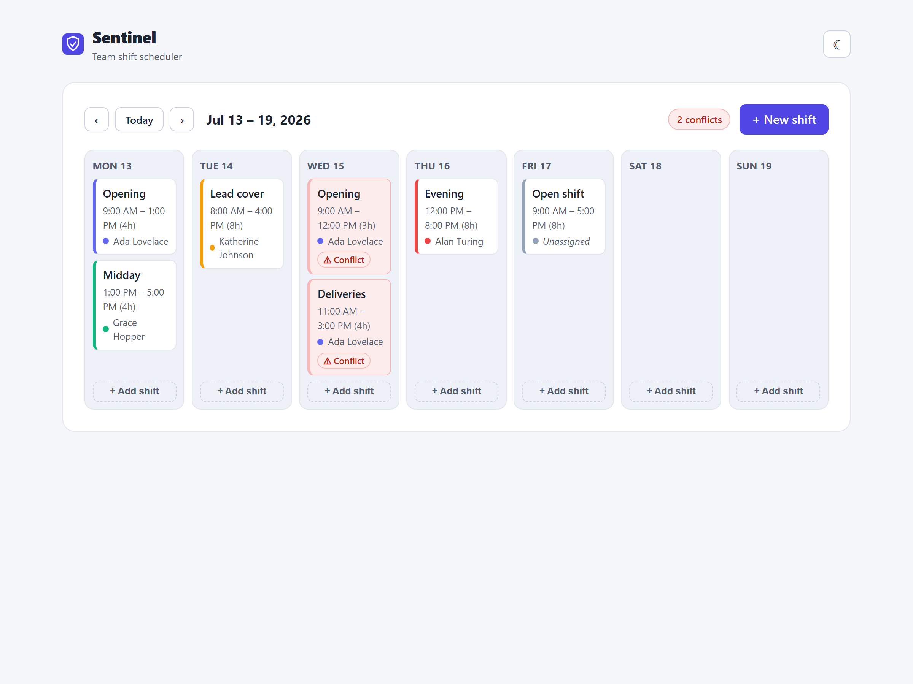
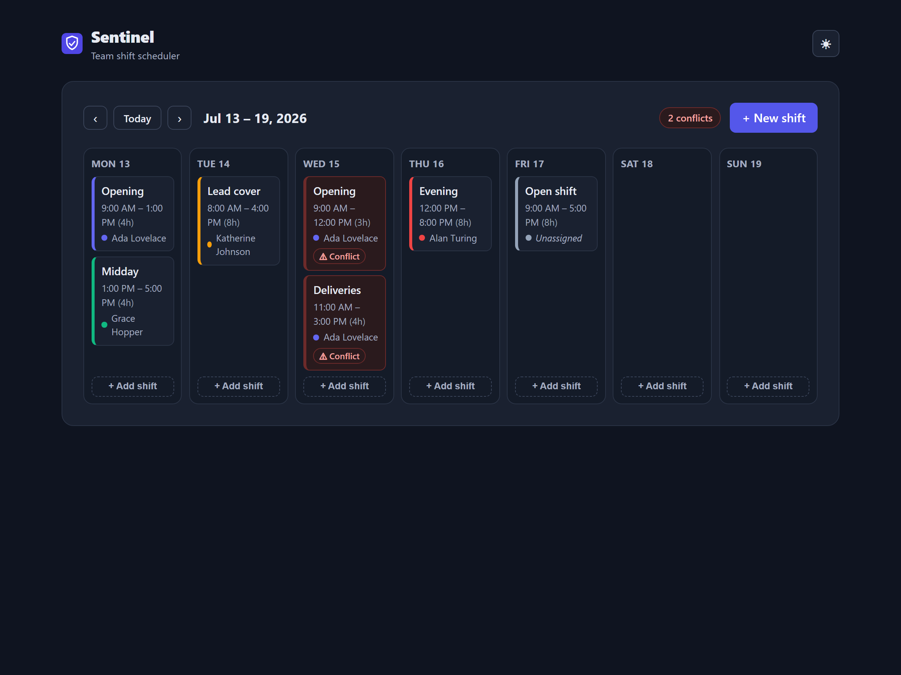
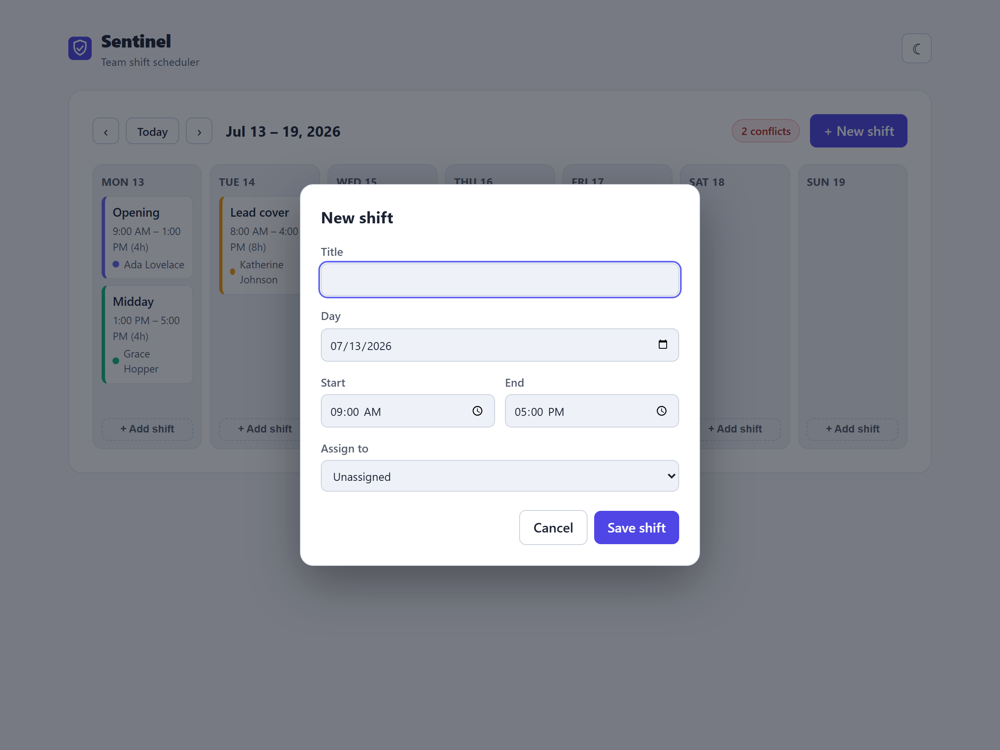
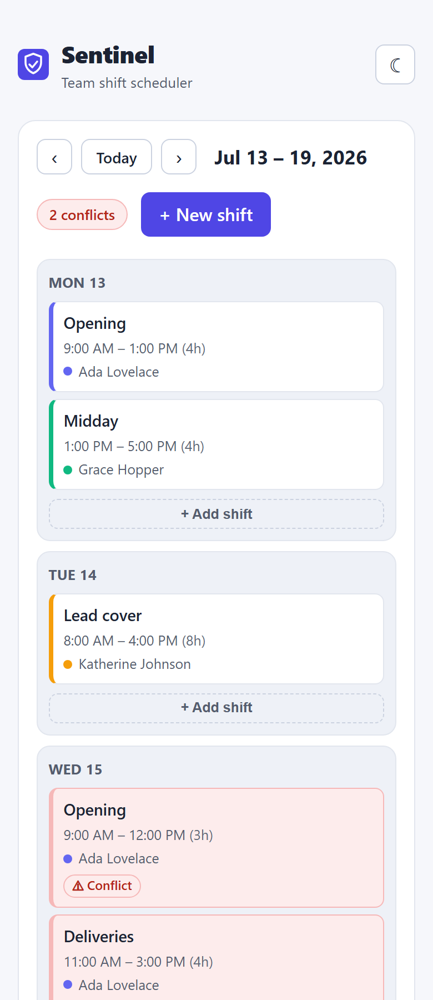

# Sentinel

A **team shift scheduler** — plan a week of shifts, assign people, and get instant
warnings when someone is double-booked. Built as a small, polished product with an
exemplary automated-testing suite and a CI/CD pipeline that gates every merge.

[](https://github.com/MattKulka/sentinel/actions/workflows/ci.yml)

[](https://playwright.dev)

> **▶ Live demo: [sentinel-eight-azure.vercel.app](https://sentinel-eight-azure.vercel.app)** — fully interactive; the API is mocked in-browser, so there's no backend to spin up.



---

## What it does

Sentinel shows a **whole team's week at a glance** and keeps the schedule honest.

- **Week view** — seven day columns (Mon–Sun) with every shift shown under its day,
  including start/end time, duration, and the assigned person (color-coded).
- **Create & edit shifts** — an accessible dialog to set a title, day, start/end
  time, and who's working. End-before-start is validated inline.
- **Conflict detection** — if the same person is booked for two overlapping shifts
  on the same day, **both cards turn red with a “Conflict” badge** and the header
  shows a running conflict count. Back-to-back shifts (e.g. 9–12 then 12–14) are
  _not_ flagged — the boundaries are treated as touching, not overlapping.
- **Assign or leave open** — shifts can be unassigned (“Open shift”) and filled later.
- **Week navigation** — jump between weeks or back to today; empty weeks show a
  friendly prompt.
- **Dark mode & responsive** — automatic light/dark with a manual toggle, and the
  grid collapses to a single column on mobile.

### Screens

| Light                                                     | Dark                                                             |
| --------------------------------------------------------- | ---------------------------------------------------------------- |
|  |  |

| Create-shift dialog                                                                                        | Mobile layout                                                                            |
| ---------------------------------------------------------------------------------------------------------- | ---------------------------------------------------------------------------------------- |
|  |  |

## How it's tested

Testing is the heart of this project — a real pyramid, with the weight (and the
strictest coverage gate) on the fast, pure logic at the bottom.

| Layer           | Tooling                              | What it covers                                                                                                                                                                     |
| --------------- | ------------------------------------ | ---------------------------------------------------------------------------------------------------------------------------------------------------------------------------------- |
| **Unit**        | Vitest                               | All business logic — conflict detection, date math, time formatting, the reducer — written edge-case-first. Coverage gated at **90%** on `src/lib` + `src/state` (currently 100%). |
| **Integration** | Vitest · React Testing Library · MSW | Components exercised through real user behavior (queried by role/label) against a mocked API.                                                                                      |
| **E2E**         | Playwright · axe-core                | Critical journeys across **Chromium, Firefox, and WebKit**, with an accessibility scan on every page in light _and_ dark mode.                                                     |

Roughly **105 tests** in total. On every pull request and push to `main`, CI runs
lint → typecheck → tests (with coverage) → build → cross-browser E2E, and a failing
test, a coverage regression, or an accessibility violation **blocks the merge**. The
Playwright HTML report is uploaded as a build artifact.

See **[TESTING.md](TESTING.md)** for the full strategy and the deliberate
trade-offs, and **[ARCHITECTURE.md](ARCHITECTURE.md)** for the conflict-detection
algorithm and state model.

## Tech stack

React 19 · TypeScript (strict, no `any`) · Vite · Vitest · React Testing Library ·
MSW · Playwright · `@axe-core/playwright` · GitHub Actions · Vercel.

## Getting started

```bash
pnpm install
pnpm dev            # http://localhost:5182 — the API is mocked by MSW, no backend needed
```

## Scripts

| Command                        | What it does                         |
| ------------------------------ | ------------------------------------ |
| `pnpm dev`                     | Dev server on port 5182              |
| `pnpm test`                    | Unit + integration tests (Vitest)    |
| `pnpm test:coverage`           | Tests with coverage + threshold gate |
| `pnpm e2e`                     | Playwright E2E across 3 browsers     |
| `pnpm lint` / `pnpm typecheck` | ESLint / `tsc` strict                |
| `pnpm build`                   | Production build                     |

## Project layout

```
src/
  lib/          pure business logic (date, time, conflict detection) + unit tests
  state/        scheduler reducer + unit tests
  hooks/        useScheduler (fetch + useReducer) + MSW integration tests
  api/          typed fetch client
  mocks/        MSW handlers, seed data, in-memory db
  components/   WeekView, ShiftCard, ShiftDialog, WeekNav, state views (+ tests)
  test/         Vitest setup + render helpers
e2e/            Playwright specs + axe scans
```
